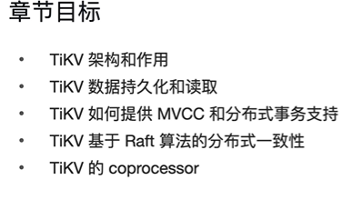
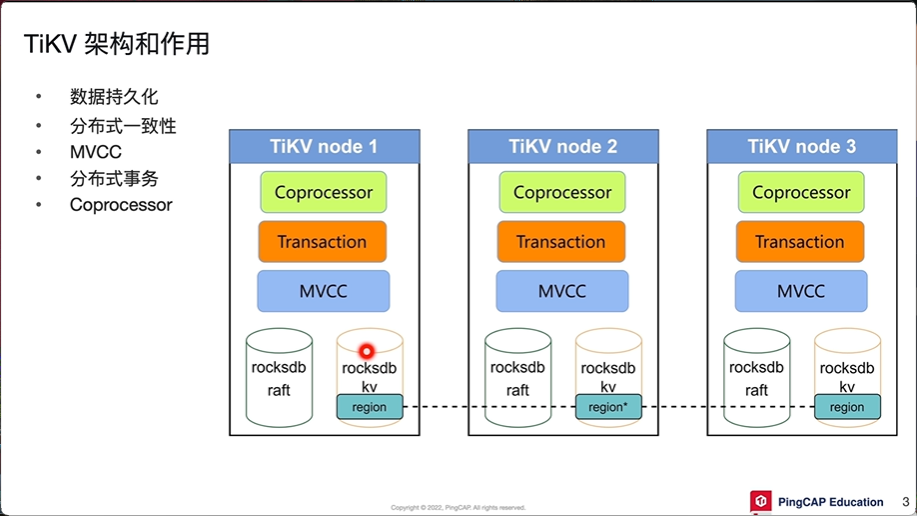
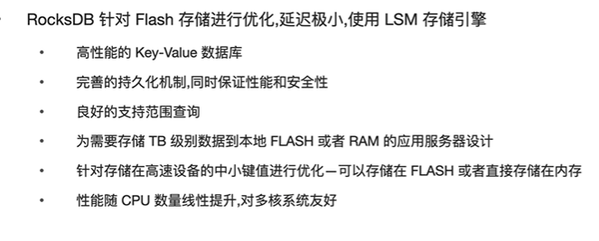

# 01 TiDB 数据库架构概述

- 水平扩容或者缩容
- 金融高级可用
- 实时HTAP
- 云原生的分布式数据库
- 兼容MySQL5.7协议

## 1、TiDB Server

- 处理客户端的连接
- Sql语句的解释和编译
- 关系型数据与KV的转化
- SQL语句的执行
- 执行online DDL
- 垃圾回收（删除历史版本的数据）

## 2、TiKV

- 数据持久化
- 副本的强一致性和高可用性
- MVCC（多版本并发控制）
- 分布式事务支持
- Coprocessor （算子下推‘）（每一个结点可以做一些计算工作----分布式计算模型）

Raft修改会把协议应用到 副本上 在哦才能够leding上复制导副本上

## 3、Placement Driver

整个集群的大脑

- 整个集群TiKV的元数据存储
- 分配全局ID和事务ID
- 生成全局时间戳TSO
- 收集信息进行调度
- 提供部分TIDB Dashboard 服务

  

## 4、TIFlash

可以列存的版本（Tikv中的修改会同步在TiFlash上面）

横存储适合交易型业务（OLTP业务），列存适合于分析型业务（OLAP）数据（引入列存可提高分析的效率）

- 异步复制
- 一致性
- 列式存储提高分析查询效率
- 业务隔离
- 智能选择（使用了TIDB Server SQL优化器）

## Summary

本次小结：

- 描述TiDB数据库的整体架构
- 理解，TIDB Server，TiKV，TiFlash和PD的主要功能。

# 02 TiDB Server（无状态的）

## 章节目标

数据放在哪里？我们是放在tiKV上的

TiDB Serve主要的功能：接受客户端的连接，不存储数据，只是做sql解析，和优化生成执行计划--->TiKV中读取数据（TiDBServer缓存）来返回给用户

- TiDB Server架构
- TiDB Server作用
- TiDB Server的进程
- TiDBServer的缓存

Protocol Layer 、Parse、Complied主要负责sql语句的解析和编译，这几个模块处理会生成sql语句的执行计划。

PDClient TIKV Cline  负责分别和PD和TIkV来交互（所有sql的请求都是通过TikV Client和TiKV来进行交互的）。

获得时间戳SPO啥的都是通过PD Client 和PD来交互得到的。

schema load \ worker \ start job  由这三个模块来执行DDL语句

## 2.2SQL语句的解析和翻译

关系型数据库要和KV型数据库要进行转换。

TIKV是将关系型数据库的表转化成了KV形式

K取了主键和表的编号，剩余列作为值（聚簇表）

regison  是TIDB里面的单位，一个便俩个，俩个变四个

DisSQl把复杂表转化成立对单个表的操作的一个一个的组合，涉及到一张表但是会多个regison。

简单sql 走KV模块，对应点查询，  Tikiv client主要对集群发送读写请求

## 在线DDL（数据定义语言）相关模块

不会阻塞读写，同一时刻只能有一个做ddl操作

多版本并发控制，TidDB是使用go语言开发的。

默认使用的全部内存

读取笔记频繁，大量，又频繁，只是读或者修改不频繁的表。

存在数据不一直，先改缓存，还是磁盘？

热点小表缓存，如何实现，，解决不一致的问题。

64mb以下。

如何保证，缓存一致？

- 缓存租约5秒，在5秒内我们可以读取缓存数据
- 如果用户要写这张表写不了锁表阻塞，等租约到期，租约中只能读不能写。
- 租约到期，小表在内存中到期了，这个时候可以写，直接写入TIKV，这个时候读的话直接读tikv。也就说这个时候读取的时候性能笔记差劲。

  租约的方式来进行的数据库一致性，。

  

  

# 03TiKV-持久化

Coprocessor叫做协同处理器

