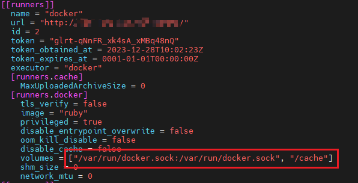

## 介绍


GitLab CI/CD 是一个内置在GitLab中的工具，用于通过持续方法进行软件开发：

- Continuous Integration (CI) 持续集成
- Continuous Delivery (CD) 持续交付
- Continuous Deployment (CD) 持续部署

使用GitLab CI/CD，还可以：

- 通过Auto DevOps轻松设置应用的整个生命周期
- 将应用程序部署到不同的环境
- 安装你自己的GitLab Runner
- Schedule pipelines
- 使用安全测试报告（Security Test reports）检查应用程序漏洞 


## 使用CICD管理自动化部署。

## 一、安装gatlub

1、安装依赖：
在安装 GitLab 之前，确保系统上已经安装了必要的依赖，如 curl、openssh-server 和 postfix（用于发送邮件通知）。
2、添加 GitLab 仓库并安装：
使用 curl 命令添加 GitLab 仓库：

```shell
curl -s https://packages.gitlab.com/install/repositories/gitlab/gitlab-ee/script.deb.sh | sudo bash
```

安装 GitLab 社区版（CE）或企业版（EE）：

```sehll
sudo EXTERNAL_URL="http://gitlab.example.com" apt-get install gitlab-ee 替换 http://gitlab.example.com
```

为你的域名或 IP 地址。
3、配置和启动 GitLab：
安装完成后，
运行配置命令：

```
sudo gitlab-ctl reconfigure
```

启动 GitLab 服务：

```
sudo gitlab-ctl start
```

置管理员密码：

访问 GitLab：在浏览器中输入 http://gitlab.example.com（替换为你的域名或 IP 地址）访问 GitLab 页面。
首次访问时，需要设置管理员密码以及登录信息。
在安装 GitLab CE 后，您需要设置一个管理员账号和密码，以便登录 GitLab CE 的 Web 界面。一般情况下，初始登录密码是随机生成的，并在安装过程中向您显示了该密码。如果您没有记录该密码，那么可以通过以下步骤来重置管理员密码：

- 打开 GitLab CE 的服务器终端，并以 root 用户身份登录。

- 运行以下命令以打开 GitLab Rails 控制台：
  gitlab-rails console

- 运行以下命令以获取管理员账号的 user_id：

```shell
user = User.where(id: 1).first
puts user.id
```

- 运行以下命令以重置管理员密码：

```shell
user.password='R#2sT8@pW!d3Md'
user.password_confirmation='R#2sT8@pW!d3Md'
user.save!
```

其中，new_password 是您要设置的新密码。

- 关闭 GitLab Rails 控制台并重新启动 GitLab CE：

```
exitg
gitlab-ctl restart
```

然后使用新密码登录 GitLab CE 的 Web 界面。

## 二、配置 GitLab 的 CI/CD    	

GitLab 项目的 CI/CD 配置中使用该 Runner 来运行**持续集成和持续交付任务**。

注意：
centos7，与 Ubuntu（乌班图系统）存在差异，命令方式存在不同，以下是乌班图的

添加 GitLab Runner 的官方存储库并安装它：

2.1、添加存储库密钥：

```
curl -L https://packages.gitlab.com/gpg.key | sudo apt-key add -
```


2.2、添加存储库：

```
echo "deb https://packages.gitlab.com/runner/gitlab-runner/ubuntu/ $(lsb_release -cs) main" | sudo tee /etc/apt/sources.list.d/gitlab-runner.list
```

2.3、更新包列表：

```shell
sudo apt update
```

2.4、安装 GitLab Runner：

```
sudo apt install gitlab-runner
```

2.5.重启相关的服务：

```
sudo systemctl daemon-reload
sudo systemctl restart gitlab-runner.service
```


2.6.确认GitLab Runner是否已经成功安装

```
gitlab-runner --version
```

这些步骤将从官方存储库中安装最新版本的 GitLab Runner。

## 三、配置gitlaub的.gitlab-ci.yml文件

在根目录中的.gitlab-ci.yml文件中指定构建、测试和部署的脚本。

在这里我只是将军一个简单的Java项目如何进行配置。

我得文件是这样：**.gitlab-ci.yml**

~~~yml
image: maven:3.8.4-jdk-8

stages:
  - build
  - deploy

build:
  stage: build
  script:
    - cd testSpringBoot  # 进入到项目文件夹
    - mvn clean package

  artifacts:
    paths:
      - testSpringBoot/target/testSpringBoot-0.0.1-SNAPSHOT.jar # 指定构建产物的路径

deploy:
  stage: deploy
  image: docker:20.10.7
  services:
    - docker:20.10.7-dind
  tags:
    - test2
  script:
    - cd testSpringBoot
    - docker build -t app-test .
    - docker run --network=host -d -p 8080:8080 app-test

~~~

并且还需要配置dockerfile

```dockerfile
FROM openjdk:8-jdk-alpine

# 设置工作目录
WORKDIR /app

# 复制应用程序代码到镜像中
COPY target/testSpringBoot-0.0.1-SNAPSHOT.jar /app/app.jar

# 暴露端口
EXPOSE 8080

# 运行应用程序
CMD ["java", "-jar", "app.jar"]
```

### 注意

在这边我遇到了一个问题？

部署的时候依赖可以加载，总是出现一种错误给大家看下？


后来这个事情，我询问了大佬说是在配置文件当中我们还需要加点东西，

在gitlab-runner的配置文件中处理

**/etc/gitlab-runner/config.toml** 在这个地址也是注册执行器的地方，多个执行器配置在这里配置runners



volumes挂载的卷：我之前没用挂载这个配置导致docekr 容器总是连接不上的，不知道为什么。

原因在此：

在Docker中，使用`-v`或`--mount`参数进行卷挂载时，如果主机上的卷不存在，则会自动创建。如果不挂载`/var/run/docker.sock:/var/run/docker.sock`和`/cache`这两个卷，可能会导致容器无法连接Docker守护进程，从而导致作业失败并返回错误码1。


`/var/run/docker.sock:/var/run/docker.sock`卷用于连接Docker守护进程

`/cache`卷可能用于存储容器的数据。

我们在用docker作为执行器的话会进行连接守护线程。总s算找到原因了。哈哈


以上有部分内容来源博客园：[狂乱的贵公子](https://www.cnblogs.com/cjsblog)    [GitLab CI/CD](https://www.cnblogs.com/cjsblog/p/12256843.html)


## 如果缺失服务器里面没有maven也需要安装下

在 Ubuntu 系统下安装 Maven，你可以按照以下步骤进行操作：

1. 打开终端（Terminal）。

2. 更新系统软件包列表，使用以下命令：

   ```
   sudo apt update
   ```

3. 安装 Maven，使用以下命令：

   ```
   sudo apt install maven
   ```

4. 在安装过程中，你可能需要输入管理员密码进行确认。

5. 安装完成后，可以通过以下命令验证 Maven 是否成功安装：

   ```
   mvn -v
   ```

   如果成功安装，你将看到 Maven 的版本信息。

现在，Maven 已经成功安装在你的 Ubuntu 系统上，你可以使用它来构建和管理 Java 项目。

