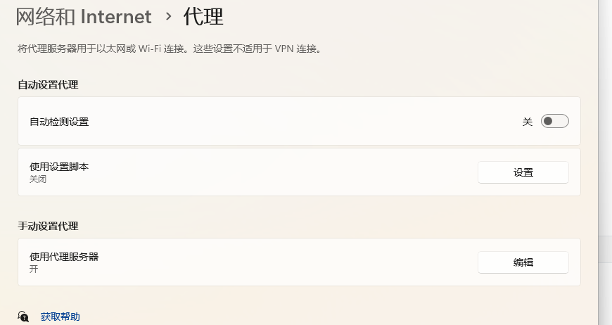
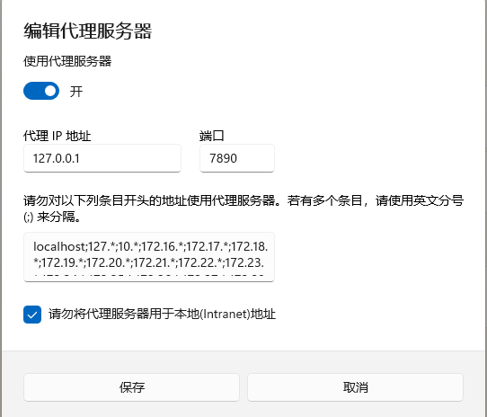

往常一样百度CSDN。。。。。。。。。。。。。。

[这位大哥的链接学习到的然后我的问题成功解决了](https://blog.csdn.net/qq_41102371/article/details/122213285)

我的系统现在是win11

## 问题：

### 能够访问github，但是拉不下来代码，前几天还能拉去代码

今天确实拉不下来了。

~~~shell
Failed to connect to github.com port 443
~~~

### 解决方案：

#### 设置网络代理

#### 编辑手动代理就好了，默认其实不用变。

对命令行设置：

~~~shell
git config --global http.proxy 127.0.0.1:7890
~~~

然后我久可以成功拉取代码了

去掉代理：

~~~shell
git config --global --unset http.proxy
~~~

去掉久没有了。