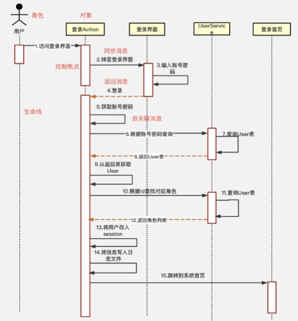

# 什么是时序图？

时序图（Sequence Diagram），又名时序图，是一种UML交互图。它通过描述对象之间发送消息时间顺序显示多个对象之间的动作协作。

# 使用场景

## 软件开发当中

## 1、梳理业务流程

业务流程比较复杂，涉及到多种角色。使用这个画，会使业务看起来非常清晰，代码写起来也是水到渠成。

## 2、梳理开源软件

梳理框架钟对象之间的关系。

# 时序图的角色

## 涉及到的元素

## 1、角色（Actor）

系统角色，可以是人或者其他系统和子系统，以一个小人图标表示

## 2、对象（Object）

对象位于时序图的顶部，以一个**矩形**表示，。对象的命名方式一般有**三种**

**对象名和类名**。例如：华为手机:手机、loginServiceObject:LoginService；

只显示**类名**，不显示对象，即为一个匿名类。例如：:手机、:LoginSservice。

只显示**对象名**，不显示类名。例如：华为手机:、loginServiceObject:。

## 3、生命线（LifeLine）

时序图中每个对象和底部中心都有一条垂直的虚线，这就是对象的生命线(对象的时间线)。以一条垂直的虚线表。

## 4、控制焦点（Activation）

控制焦点代表时序图中在对象时间线上某段时期执行的操作。以一个很窄的矩形表示。

## 5、消息（Message）

表示对象之间发送的消息。**消息分为三种类型**。

**同步消息（Synchronous Message）**

消息的发送者把控制传递给消息的接收者，然后停止活动，等待消息的接收者放弃或者返回控制。用来表示同步的意义。以一条实线和实心箭头表示。

**异步消息（Asynchronous Message）**

消息发送者通过消息把信号传递给消息的接收者，然后继续自己的活动，不等待接受者返回消息或者控制。异步消息的接收者和发送者是并发工作的。以**一条实线和大于号表示**。

**返回消息(Return Message)**

返回消息表示从过程调用返回。以**小于号和虚线表示**。

## 6、自关联消息

表示方法的自身调用或者一个对象内的一个方法调用另外一个方法。以一个半闭合的长方形+下方实心剪头表示。

下面举例一个时序图的列子，看下上面几种元素具体的使用方式。

## 7、组合片段

组合片段用来解决交互执行的条件和方式，它允许在序列图中直接表示逻辑组件，用于通过指定条件或子进程的应用区域，为任何生命线的任何部分定义特殊条件和子进程。组合片段共有13种，名称及含义如下：

组合名称组合含义

ref引用其他地方定义的组合片段

alt在一组行为中根据特定的条件选择某个交互

opt表示一个可选的行为

break提供了和编程语言中的break类拟的机制

par支持交互片段的并发执行

seq强迫交互按照特定的顺序执行

strict明确定义了一组交互片段的执行顺序

neg用来标志不应该发生的交互

region标志在组合片段中先于其他交互片断发生的交互

ignore明确定义了交互片段不应该响应的消息

consider明确标志了应该被处理的消息

assert标志了在交互片段中作为事件唯一的合法继续者的操作数

loop说明交互片段会被重复执行

组合片段的功能平时用的不是很多，具体使用时可以参考本文最后关于组合片段的文章，这边不做深入介绍了。

学习来源[摘抄自知乎的一个老哥写的感觉不错](https://zhuanlan.zhihu.com/p/402082623)

