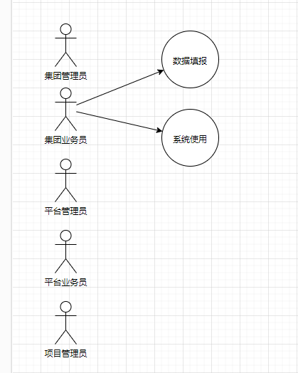

# 数字孪生平台HLD 

# 版本修订

| 修订日期 | 修订版本 | 修订描述                                                     | 修订人 | 评审人 |
| -------- | -------- | ------------------------------------------------------------ | ------ | ------ |
| 20221221 | V0.1     | hld初版，方案验证，服务架构拓扑，业务架构，业务模型、数据模型、用例模型 | 刘正超 |        |

# 1.   项目背景

在需求文档中之间拿过来就行了。

# 2.   技术组件选型

前端使用百度开源Amis。

后端使用大数据平台的jeecgboot低代码框架、分布式定时任务xx-job来实现定时生成任务处理，数据库存储采用TIDB，在copm中新建数字孪生模块服务。

缓存采用redis来实现，增加数据查询性能。本次需求只是针对填报内容处理不是狠复杂，常规业务处理。

# 3.   业务分析

## 3.1. 本次需求核心业务动作

本次平台搭建模块划分以下。

- 项目经营视图
- 项目档案
- **数据填报**
  - 规则配置
  - 任务管理
  - 任务列表
- 数据简报
- 专项看板
- 数据预警

以上几个模块是由产品所提供的方向。

暂时我们现在只是先完成数据填报。看了产品画的UI图，数据填报这里有俩部门内容：

展示，当前人员角色信息。

- 填报首页
  - 待办任务
  - 草稿箱
  - 已完成任务
- 我得表单
  - 数据展示，任务查询，任务信息，导入，导出登功能
  - 待执行任务
  - 草稿箱--**与首页展示出现重复**
  - 已完成任务---**与首页展示出现重复**

系统的操作角色有5个

**这块的设计存在缺漏，采用的是大数据门户的权限管控，管理员的权限不能在这里处理。**

核心操作，下载文件，导入文件处理。未说明规范，以及功能逻辑。

任务自动生成，：产品文档上未说明，未说明功能逻辑处理。

## 3.2. 业务交互

需要调用数据中台接口来获取数据，联调人是梁宏志

## 3.3. 流程图

按照自己理解来把。

核心流程，填报。主要是从生成任务开始

# 4.   用例图

 

   

# 5.   业务架构

|                |
| -------------- |
| 图5-1 逻辑模型 |

 

# 6.   模块逻辑关系

 

市拓报表系统模块互动逻辑如下：

|                                      |
| ------------------------------------ |
| 图6-1 市拓报表系统与其他模块关系拓扑 |

# 7.   数据模型

## 7.1. 概念模型

存储规则配置信息：rule_config表

## 7.2. 数据模型

 待产品确认完全到底如何处理把这里。

# 8.   核心逻辑时序图

 

  

# 9.   风险问题

- 产品功能逻辑需求文档不清晰，导致开发进度会缓慢

- 原型图没画，交互逻辑不清晰

- 规则配置处理

- 导出，批量导出

  

   

 

 

 

 

 

 

 

 

 

邮箱发送记录这块。

发送时间和任务发送时间（都存在发送时间） 按照任务来记录，还是收件人个数来记录

邮箱记录编辑（已取消）

重发：是单条对收件人重发么？还是对整体任务重发。

批量重发（应该是单独对收件人重发把）

这块可以对应上面得统计任务区，怎么算完成一个任务

   

 

 

 

邮箱发送人，需要提供密码。

 

 