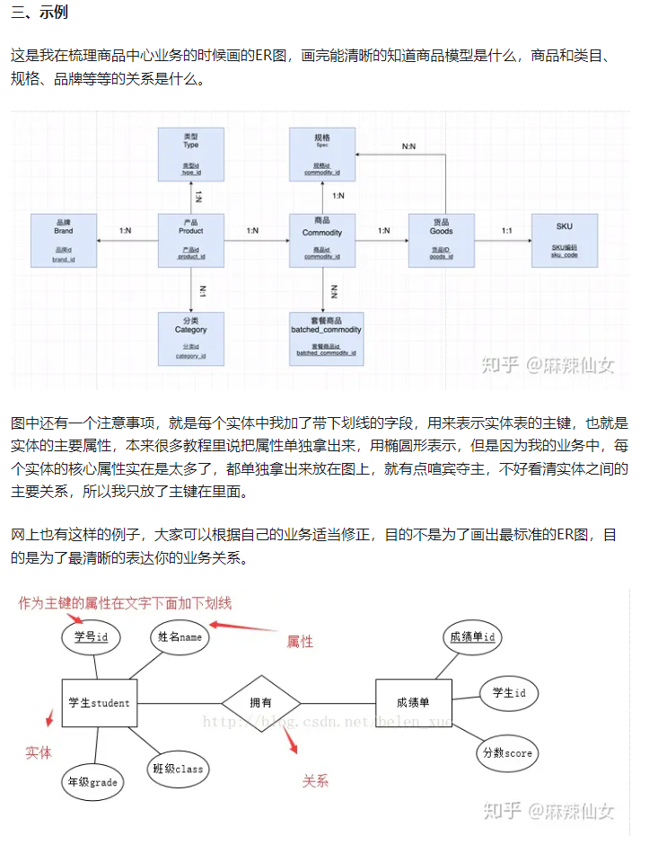

说起ER图就要解决数据库设计方面;

数据库设计大致可分为如下几个阶段：

**需求分析 → 概念设计 → 逻辑设计 → 物理设计 → 数据库实现 → 运行与维护阶段**。

## **一、ER(Entity Relationship)图能用来干什么？**

ER图一般用来表达数据库表的关系，对于产品来说，特别适合在业务梳理时用，研发一般很忙没空挨个字段给你讲解，那最好的熟悉系统中后台逻辑的方式，就是开个数据库的权限，你自己研究下各个表，画个表关系的ER图，画的过程中肯定会有很多问题，积攒起来统一咨询研发，画完你就对整个系统很清楚了。

## **二、ER图是什么？**

Entity就是数据模型中的数据对象，比如在电商业务中，商品、订单、类目都可以作为一个数据对象，画图的时候用长方体来表示。

Relationship就是用来表现Entity和Entity之间的联系，例如商品和类目有一定的联系，每个类目都包含了一些商品，每个商品也能找到属于哪个类目，这就是一种关系，画图的时候用菱形来表示。

这种实体关系有3种：

1对1(1:1)，1对1关系是指对于实体A和实体B来说，A只能对应一个B，B也只能对应一个A。

1对多(1:N)，1对多是指实体A可以对应多个实体B，但是实体B只能对应一个A。

多对多(N:N)，多对多是指实体A可以对应多个实体B，实体B也能对应多个实体A。

有时候为了简略，也可以不用画菱形，直接标明实体A和实体B的对应关系即可，具体可以看下面的例子。

虽然讲解的比较省略把我觉得但是很简单通俗易懂。[原文链接](https://zhuanlan.zhihu.com/p/342506138)